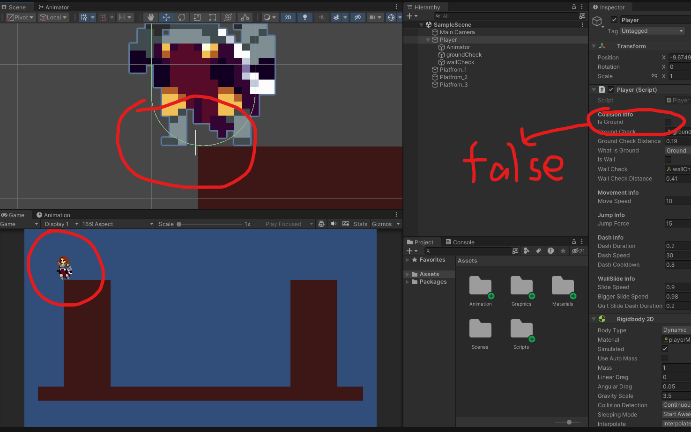
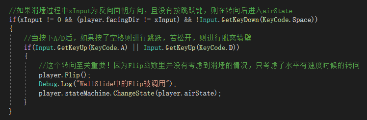

# 1 逆天悬崖禁足bug
- 当人物站在悬崖边上的时候，若地面检测线恰巧在空中，这样人物处于Idle状态中，而从Idle到Move需要的条件是`isGround && xInput != 0`，导致人物卡在悬崖边上无法移动
- 感觉或许可以增加几条检测线？
- 或者可以把检测线往人面朝方向的反方向移动一点，因为人物一般不会背对着悬崖并突出一小段，进入这种奇怪的bug状态；但这样如果是走一半突然转头，就会进入到这个bug状态，所以不是很可取
- 把检测线横着放，往下移一点！！

# 2 跳开墙壁的交互问题
- 人物脱离滑墙状态的时候（比如是左边的墙），按D能让人物脱离滑墙状态；按空格能让人物跳开墙。一般人想要跳开墙是想按D然后再按空格的，但这样会先触发脱离墙壁的状态转换，导致还没来得及按空格就掉下去了
- 尝试过通过以下方式解决，但是KeyUp不起作用

- 暂时直接删除除跳跃键以外的离开滑墙方式，可以通过S键加速下滑